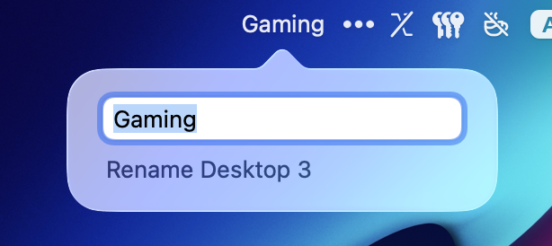
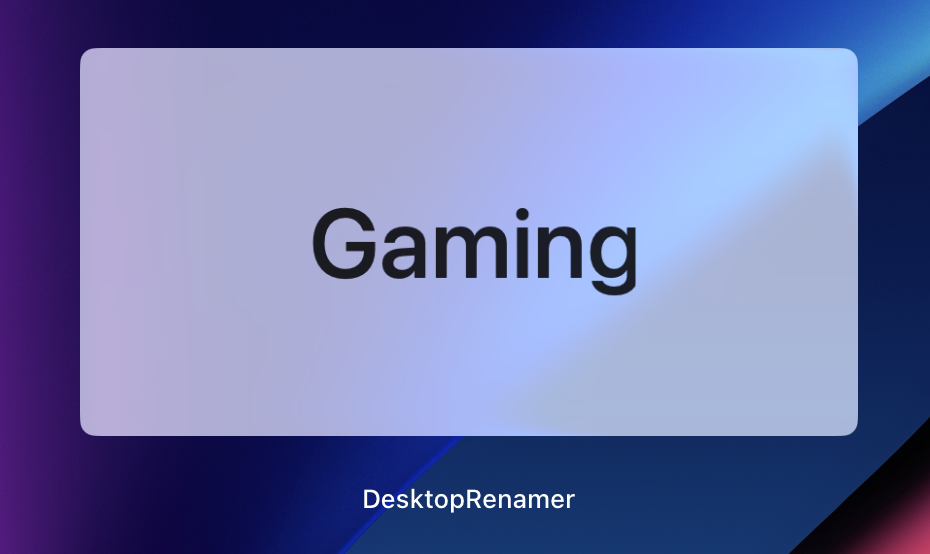
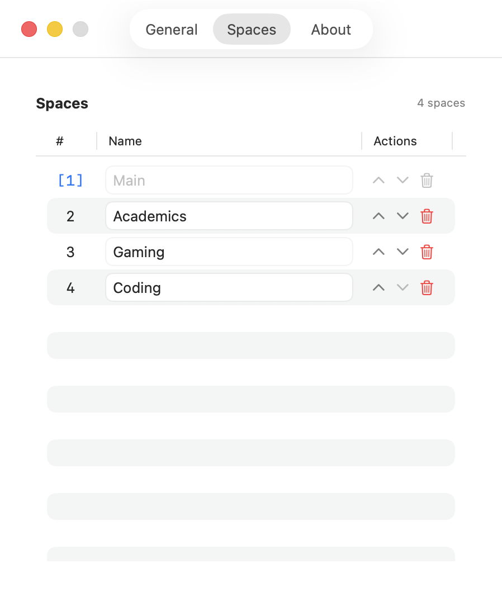
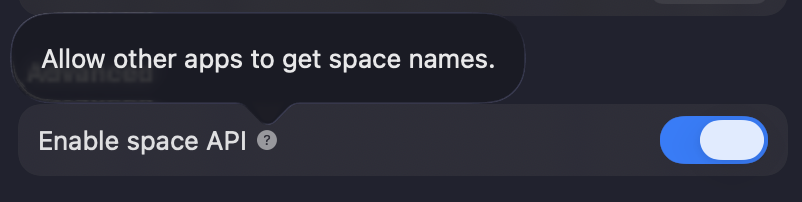

<!-- v1.6.0 -->

<h1 align="center">
    
  

  
DesktopRenamer

</h1>

<table align="center" border="0" cellpadding="0" cellspacing="0">
  <tr>
    <td align="center">
       
      <i>Rename desktop label in menubar</i>
    </td>
    <td align="center">
       
      <i><b>SpaceLabelWindow</b> will be shown when entering Mission Control</i>
    </td>
  </tr>
  <tr>
    <td align="center">
       
      <i>Edit spaces in settings</i>
    </td>
    <td align="center">
       
      <i>
        Open
        <a href="https://github.com/gitmichaelqiu/DesktopRenamer/wiki/DesktopRenamer-API-Guide">
        <b>SpaceAPI</b>
        </a>
        to other apps
      </i>
    </td>
  </tr>
</table>

**DesktopRenamer** is a macOS menubar app that shows your **customized** name of the current desktop.

## 📦 Installation

You do **NOT** have to disable *SIP* or things like that. Your macOS must be at least **macOS 13.0 Ventura**. All you need to do is:

1. Download the package from [Releases](https://github.com/gitmichaelqiu/DesktopRenamer/releases/)
2. Drag the app to the *Applications* folder
3. All set!

Because I do **NOT** have an Apple developer account for the app releases ~~(Apple charges an annual fee for this)~~, you may receive alerts such as "App is broken".

To resolve this, go to System Settings → the bottom of Privacy & Security → Open DesktopRenamer.

## 🛜 API

This app provides an API to acquire space ID and names.

Check [Developer API Guide](https://github.com/gitmichaelqiu/DesktopRenamer/wiki/DesktopRenamer-API-Guide) for details.

You can switch on/off the API in Settings → Advanced.

## ⚠️ Issues

You are welcome to create issues/suggestions in [GitHub Issues](https://github.com/gitmichaelqiu/DesktopRenamer/issues).

For the issue that all of the spaces are marked as "Fullscreen", please check the [Troubleshoot](./Troubleshoot.md).

The app will only work in the main display if you connect to **multiple** displays. I am currently working on solving this. If you have any ideas, welcome to post them in [GitHub Issues](https://github.com/gitmichaelqiu/DesktopRenamer/issues).

If you have encountered any other bugs, please generate a bug report in DesktopRenamer Settings → General. This will help a lot for analyzing the bugs!

## ⭐ Support This Project

You can simply click on the **Star** to support this project for free. Thank you for your support!

